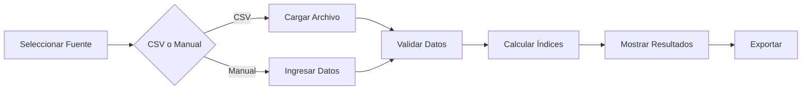

# 💧 Calculadora de Índices de Calidad de Agua

[](/)
[](/)

> **Ruta:** `/ambiental/herramientas/indice-calidad-agua`

## Descripción

Herramienta profesional para calcular índices de calidad de agua potable a partir de datos de laboratorio. Soporta múltiples metodologías internacionales con explicación detallada de cálculos.

## Índices Soportados

### 🇨🇴 IRCA - Índice de Riesgo de Calidad del Agua Potable
- **Marco Legal**: Resolución 2115 de 2007 (Colombia)
- **Rango**: 0% (sin riesgo) a 100% (inviable sanitariamente)
- **Parámetros**: 22 parámetros fisicoquímicos y microbiológicos
- **Categorías**: Sin riesgo, Bajo, Medio, Alto, Inviable

### 🌍 WQI - NSF Water Quality Index
- **Origen**: National Sanitation Foundation (USA)
- **Rango**: 0 (peor) a 100 (mejor)
- **Parámetros**: 9 parámetros con pesos ponderados
- **Categorías**: Excelente, Buena, Media, Mala, Muy Mala

### 🔬 DWQI - Drinking Water Quality Index
- **Aplicación**: Internacional
- **Rango**: 0 (mejor) a 100+ (peor)
- **Parámetros**: Variables según estándares locales
- **Categorías**: Excelente a Inadecuada

## Funcionalidades

### 📁 Carga de Datos
- **CSV**: Carga masiva de múltiples muestras
- **Manual**: Entrada individual de parámetros (próximamente)
- **Validación**: Verificación automática de formatos

### 📊 Resultados
- Valor numérico del índice
- Categoría de calidad con colores
- Nivel de riesgo asociado
- Parámetros faltantes
- Explicación detallada del cálculo

### 📤 Exportación
- CSV con resultados completos
- Memoria de cálculo
- Comparativa entre muestras

## Arquitectura

```
indice-calidad-agua/
├── page.tsx                 # Componente principal (436 líneas)
├── layout.tsx              # SEO metadata
├── README.md               # Documentación
├── components/
│   └── DataSourceSelector.tsx  # Selector de fuente
├── data/
│   ├── irca-parameters.ts     # Parámetros IRCA
│   ├── wqi-parameters.ts      # Parámetros WQI
│   └── dwqi-parameters.ts     # Parámetros DWQI
├── types/
│   └── index.ts               # Tipos TypeScript
└── utils/
    ├── calculate-irca.ts      # Cálculos IRCA
    ├── calculate-wqi.ts       # Cálculos WQI
    ├── calculate-dwqi.ts      # Cálculos DWQI
    ├── csv-utils.ts           # Utilidades CSV
    └── __tests__/
        ├── calculate-irca.test.ts
        ├── calculate-wqi.test.ts
        ├── calculate-dwqi.test.ts
        └── csv-utils.test.ts
```

## Formato CSV Esperado

```csv
fecha,ubicacion,pais,parametro,valor,unidad
2024-01-15,Planta Norte,Colombia,pH,7.2,unidades
2024-01-15,Planta Norte,Colombia,Turbiedad,2.5,NTU
2024-01-15,Planta Norte,Colombia,Color aparente,10,UPC
2024-01-15,Planta Norte,Colombia,Coliformes totales,0,UFC/100mL
```

## Parámetros por Índice

### IRCA (22 parámetros)
| Grupo | Parámetros |
|-------|------------|
| Microbiológicos | Coliformes totales, E. coli, Mesófilos |
| Fisicoquímicos | pH, Turbiedad, Color, Olor, Sabor |
| Químicos | Cloro residual, Hierro, Manganeso, Aluminio |
| Otros | Conductividad, Sulfatos, Cloruros, Nitratos |

### WQI (9 parámetros)
- Oxígeno disuelto, Coliformes fecales, pH
- DBO5, Temperatura, Fosfatos
- Nitratos, Turbiedad, Sólidos totales

## Tests

```bash
# Ejecutar todos los tests
npx vitest run src/app/(portals)/ambiental/(marketing)/herramientas/indice-calidad-agua

# Tests específicos
npx vitest run calculate-irca.test.ts
npx vitest run calculate-wqi.test.ts
npx vitest run calculate-dwqi.test.ts
npx vitest run csv-utils.test.ts
```

## Fórmulas de Cálculo

### IRCA
```
IRCA (%) = (Σ puntajes asignados / Σ puntajes máximos) × 100
```

### WQI
```
WQI = Σ (wi × Qi)
donde:
- wi = peso del parámetro i
- Qi = subíndice de calidad del parámetro i
```

### DWQI
```
DWQI = Σ (Wi × qi)
donde:
- Wi = peso relativo
- qi = índice de calidad individual
```

## Flujo de Trabajo



## SEO

- **Title**: Calculadora de Índices de Calidad de Agua | IRCA, WQI, DWQI
- **Keywords**: IRCA, WQI, DWQI, calidad agua potable, Resolución 2115
- **Structured Data**: WebApplication schema

## Notas de Desarrollo

> ⚠️ La entrada manual de datos está marcada como "En desarrollo". Priorizar implementación para completar funcionalidad.

---

**Mantenido por:** AquatechIA Team  
**Última actualización:** Diciembre 2024
